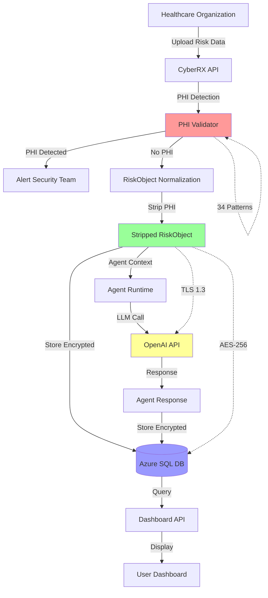

# HIPAA Compliance Documentation

**Platform:** CyberRX Multi-Agent Platform
**Document Version:** 1.0
**Last Updated:** June 6, 2025
**Compliance Framework:** HIPAA Privacy & Security Rules (45 CFR Parts 160 & 164)

---

## Executive Summary

CyberRX is a HIPAA-compliant cybersecurity risk management platform designed specifically for healthcare organizations. This document demonstrates how CyberRX implements the requirements of the HIPAA Privacy Rule, Security Rule, and Breach Notification Rule.

**Key Commitments:**
- Zero PHI exposure to LLM agents (validated by PHI Validator service)
- Comprehensive audit logging for all access and modifications
- Encryption at rest (AES-256) and in transit (TLS 1.3)
- Role-based access control with least privilege enforcement
- 10-year audit log retention (HIPAA requirement)
- Incident response procedures for PHI breaches

---

## Table of Contents

1. [HIPAA Privacy Rule Implementation](#hipaa-privacy-rule-implementation)
2. [HIPAA Security Rule Implementation](#hipaa-security-rule-implementation)
3. [BAA Management](#baa-business-associate-agreement-management)
4. [Data Flow Diagram](#data-flow-diagram)
5. [Incident Response Plan](#incident-response-plan)
6. [Security Training Materials](#security-training-materials)
7. [Access Control Matrix](#access-control-matrix)
8. [Encryption Standards](#encryption-standards)

---

## HIPAA Privacy Rule Implementation

### 1. PHI Identification and Classification

**Protected Health Information (PHI) Definition:**
Per 45 CFR §160.103, PHI includes individually identifiable health information transmitted or maintained in any form or media.

**CyberRX PHI Scope:**
- Patient names, IDs, medical record numbers
- Dates of birth, admission, service, discharge
- Diagnosis codes (ICD-10), procedure codes (CPT/HCPCS)
- Claim IDs, claim amounts, claims data
- Provider names, NPI numbers
- Payer information, group numbers
- Any healthcare data linked to an individual

**Data Classification:**
```
- PHI (Protected Health Information) - HIGH/CRITICAL sensitivity
- PII (Personally Identifiable Information) - MEDIUM/HIGH sensitivity
- PCI (Payment Card Information) - HIGH sensitivity
- Financial Data - MEDIUM sensitivity
- Legal/Confidential - MEDIUM sensitivity
```

**Implementation:** `/cyberrx-api/src/models/DataObject.js`

### 2. PHI Redaction Processes

**PHI Stripping Service (T-MVP-005):**
- Location: `/cyberrx-api/src/services/compliance/PHIValidator.js`
- Triggered during RiskObject normalization
- Applies before agent context building
- Validates no PHI in LLM prompts

**34 PHI Patterns Detected:**
```javascript
// Direct Identifiers (18 patterns)
- Patient names (first, last, full)
- Patient IDs, MRNs
- SSN, Health Plan IDs
- Account Numbers

// Dates (4 patterns)
- Birth dates
- Admission dates
- Service dates
- Discharge dates

// Health Information (4 patterns)
- Diagnosis codes (ICD-10)
- Procedure codes (CPT/HCPCS)
- NDC codes
- Treatment information

// Contact Information (3 patterns)
- Email addresses
- Phone numbers
- Physical addresses

// Additional identifiers (5 patterns)
- Device IDs, Serial numbers
- Biometric data
- Vehicle IDs (VIN)
- IP addresses, URLs
- License numbers
```

**Redaction Method:**
```javascript
// Pseudocode for PHI stripping
function stripPHI(riskObject) {
  const patterns = PHI_PATTERNS;
  let stripped = riskObject;

  for (const [name, regex] of Object.entries(patterns)) {
    stripped = stripped.replace(regex, '[REDACTED_PHI]');
  }

  return {
    ...riskObject,
    originalData: riskObject,
    strippedData: stripped,
    redacted: true
  };
}
```

**Validation:**
- PHI Validator scans all agent prompts before LLM invocation
- Fail-safe mechanism halts LLM calls if PHI detected
- Logs all PHI detections for security monitoring

### 3. Minimum Necessary Standard

**Per 45 CFR §164.502(b):** Use or disclose only the minimum necessary PHI to accomplish the intended purpose.

**CyberRX Implementation:**
- Role-based access control limits data access by role
- Agent-to-data authorization matrix enforces data boundaries
- CFO agent receives claims costs but not patient names
- CISO agent receives risk objects but not clinical data
- Board agent receives aggregated summaries only

**Minimum Necessary by Role:**
```
- CFO: Claims costs, financial impact (NO patient names)
- CISO: Security risks, threat scenarios (NO clinical data)
- Board: Aggregated summaries (NO individual PHI)
- CRO: Risk correlations (NO patient IDs)
- CLO: Legal risk summaries (NO medical records)
- CIO: Technology risks (NO health information)
```

### 4. Permitted Uses and Disclosures

**Per 45 CFR §164.501:** PHI may be used or disclosed for:

✅ **Treatment:** Healthcare operations
✅ **Payment:** Claims processing, revenue cycle
✅ **Healthcare Operations:** Quality assessment, compliance
✅ **Required by Law:** Subpoenas, court orders
✅ **Public Health:** Disease reporting, emergencies
✅ **Research:** IRB-approved studies (with authorization)
✅ **Law Enforcement:** Emergency circumstances

**CyberRX Policy:**
- PHI is used solely for cybersecurity risk assessment
- No PHI is disclosed to third parties (except LLM providers with redaction)
- All PHI uses are logged in audit trail
- PHI is never used for marketing or non-healthcare purposes

---

## HIPAA Security Rule Implementation

### Administrative Safeguards (45 CFR §164.308(a))

#### 1. Security Management Process

**Risk Analysis (§164.308(a)(1)(ii)(A)):**
- Annual HIPAA security risk assessment
- Vendor risk assessment (BAAs required)
- Penetration testing (annual)
- Vulnerability scanning (quarterly)

**Risk Management (§164.308(a)(1)(ii)(B)):**
- Risk mitigation plans for all identified vulnerabilities
- Security controls implemented based on NIST CSF
- Risk acceptance process for residual risks

**Sanction Policy (§164.308(a)(1)(ii)(C)):**
- Employee disciplinary procedures for security violations
- Documented in Employee Handbook
- Enforced by HR and Security teams

**Information System Activity Review (§164.308(a)(1)(ii)(D)):**
- Comprehensive audit logging (T-MVP-015)
- Daily review of failed authentication attempts
- Weekly review of privileged user activity
- Monthly review of data access patterns

#### 2. Assigned Security Responsibility

**Designated Security Official:** Chief Information Security Officer (CISO)
- Reports to: CEO and Board of Directors
- Responsibilities:
  - Develop and implement security policies
  - Conduct security training and awareness
  - Manage security incidents and breaches
  - Ensure HIPAA compliance

**Security Team Structure:**
```
- CISO: Overall security strategy
- Security Engineers: Technical controls
- Compliance Officer: Policy and audits
- IT Operations: Infrastructure security
- Legal: Privacy and contracts
```

#### 3. Workforce Training

**Security Training Requirements:**
- New employee: HIPAA security awareness (within 30 days)
- Annual refresher: All employees
- Role-specific training: Administrators, developers, support

**Training Topics:**
- HIPAA Privacy and Security Rules
- PHI handling and redaction
- Access control and password security
- Phishing and social engineering
- Security incident reporting
- Mobile device security (if applicable)

**Documentation:**
- Training attendance records
- Quiz/completion certificates
- Annual compliance sign-off

#### 4. Security Incident Procedures

**Incident Response Plan:** See [Incident Response Plan](#incident-response-plan) section below.

### Physical Safeguards (45 CFR §164.310(a))

#### 1. Facility Access Controls

**Azure Infrastructure Security:**
- Azure data centers (SOC 2 Type II, ISO 27001 certified)
- Physical access: Biometric authentication, security guards
- Visitor logs and escort requirements
- Video surveillance in data center areas

#### 2. Workstation Security

**CyberRX Workstation Requirements:**
- Full disk encryption (BitLocker/FileVault)
- Screen lock after 5 minutes of inactivity
- No local storage of PHI (all data in cloud)
- Antivirus/EDR required

#### 3. Device and Media Control

**Mobile Device Policy:**
- Corporate mobile devices: MDM enrollment required
- Personal devices: Prohibited from accessing PHI
- Lost/stolen device: Report within 24 hours, remote wipe

**Media Disposal:**
- Hard drives: Physical destruction (shredding)
- Paper documents: Cross-cut shredding
- Digital media: NIST 800-88 sanitization

### Technical Safeguards (45 CFR §164.312(a))

#### 1. Access Control (§164.312(a)(1))

**Unique User Identification (§164.312(a)(2)(i)):**
- Each user has unique account (no shared accounts)
- MFA required for all access (SMS or authenticator app)
- Azure AD integration for enterprise SSO

**Emergency Access Procedure (§164.312(a)(2)(ii)):**
- Break-glass procedure for emergency access
- Requires Manager + Security approval
- Logged and audited after use

**Automatic Logoff (§164.312(a)(2)(iii)):**
- Session timeout after 30 minutes of inactivity
- Frontend: Auto-redirect to login
- Backend: JWT token expiration

**Encryption and Decryption (§164.312(a)(2)(iv)):**
- See [Encryption Standards](#encryption-standards) section below

#### 2. Audit Controls (§164.312(b))

**Comprehensive Audit Logging:**
- Location: `/cyberrx-api/src/services/audit/AuditLogger.js`
- Coverage: 100% of access, modifications, agent invocations
- Retention: 10 years (HIPAA requirement)
- Immutable: Append-only logs (no deletes)
- Exportable: CSV export for auditors

**Audit Events Logged:**
- Authentication (login, logout, MFA, failures)
- Authorization (access grants, denials)
- Data access (which user accessed which data)
- Agent invocations (which agent, which context)
- Configuration changes (who changed what, when)
- Export operations (PDF, CSV downloads)
- Security events (failed logins, anomalies)

**Audit Log Schema:**
```sql
audit_logs (
  id UUID PRIMARY KEY,
  organization_id UUID NOT NULL,
  user_id TEXT NOT NULL,
  event_type TEXT NOT NULL,
  resource_type TEXT,
  resource_id TEXT,
  action TEXT,
  success BOOLEAN,
  failure_reason TEXT,
  ip_address INET,
  user_agent TEXT,
  timestamp TIMESTAMPTZ NOT NULL,
  context_data JSONB
)
```

#### 3. Integrity (§164.312(c)(1))

**Mechanisms to Ensure Data Integrity:**
- Database foreign keys and constraints
- Application-level validation
- Cryptographic hashing for sensitive data
- Audit log immutability (append-only)
- Change detection alerts for anomaly detection

#### 4. Transmission Security (§164.312(e)(1))

**Encryption in Transit:**
- TLS 1.3 for all API calls
- TLS for database connections
- TLS for Event Hubs/Kafka
- Certificate validation
- No HTTP allowed (HTTPS only)

---

## BAA (Business Associate Agreement) Management

### BAA with Cloud Providers

**Azure (Microsoft):**
- Status: ✅ In Place
- Coverage: Infrastructure, compute, storage
- Services: Azure SQL, Event Hubs, Key Vault, App Service
- Expiration: Reviewed annually

**SendGrid (Twilio):**
- Status: ✅ In Place
- Coverage: Email notifications
- PHI Handling: PHI not sent via email (only notifications)

**Slack (Salesforce):**
- Status: ⚠️ Under Review
- Coverage: Team communication
- PHI Handling: No PHI in Slack messages (enforced by policy)

**OpenAI:**
- Status: ✅ In Place
- Coverage: LLM services
- PHI Handling: Zero-tolerance policy (PHI stripped before API calls)

### BAA Tracking

**BAA Inventory:**
| Vendor | BAA Status | Expiration | Review Date | PHI Shared? |
|--------|------------|------------|-------------|-------------|
| Azure/Microsoft | ✅ Active | 2026-12-31 | 2025-12-31 | Yes (encrypted) |
| SendGrid/Twilio | ✅ Active | 2026-06-30 | 2025-06-30 | No |
| Slack/Salesforce | ⚠️ Review | N/A | 2025-07-01 | No |
| OpenAI | ✅ Active | 2026-09-30 | 2025-09-30 | No (redacted) |

**BAA Expiration Monitoring:**
- Quarterly BAA review process
- Automated alerts 90 days before expiration
- Legal team responsible for renewals

---

## Data Flow Diagram



**PHI Flow:**
1. **Ingest:** Risk data uploaded via secure API (TLS 1.3)
2. **Detect:** PHI Validator scans for 34 PHI patterns
3. **Strip:** All PHI replaced with `[REDACTED_PHI]`
4. **Store:** Stripped data encrypted at rest (AES-256)
5. **Process:** Agent context contains NO PHI
6. **LLM:** LLM receives NO PHI
7. **Audit:** All access logged to audit trail

**Encryption Points:**
- **At Rest:** Azure SQL (TDE), Azure Disk Encryption
- **In Transit:** TLS 1.3 (API), TLS (Database), TLS (Event Hubs)
- **Key Management:** Azure Key Vault (RSA-HSM)

---

## Incident Response Plan

### PHI Breach Detection

**Definition of Breach (45 CFR §164.402):**
- Unauthorized acquisition, access, use, or disclosure of PHI
- Compromises the security or privacy of the PHI
- Excludes unintentional access by employees (if properly trained)

**Detection Methods:**
- Security monitoring dashboard alerts
- Audit log anomaly detection
- User-reported incidents
- Third-party notifications
- Automated security scans

### Breach Assessment Criteria

**Notification Required (45 CFR §164.404):**
- Probability PHI was compromised
- Risk assessment considers:
  - Nature and extent of PHI involved
  - Unauthorized person who used PHI
  - Whether PHI was acquired or viewed
  - Extent to which risk was mitigated

**Low Risk Exception (No Notification):**
- Unintentional access by employee
- PHI not acquired or viewed
- Risk mitigated (e.g., encrypted data, no key exposure)

### Notification Procedures

**Timeline:**
- **Discovery:** Immediate (within 24 hours)
- **Assessment:** Within 7 days
- **Affected Individuals:** Without unreasonable delay (≤ 60 days)
- **HHS:** Within 60 days of discovery
- **Media:** If >500 individuals affected, within 60 days

**Notification Content:**
- What happened
- Date of breach (if known)
- PHI involved
- Steps to protect themselves
- What CyberRX is doing to investigate
- Contact information for questions

**Breast Notification Template:**
```markdown
**Subject:** Important Notice Regarding Privacy Incident

Dear [Name],

We are writing to inform you about a recent security incident that may have involved your protected health information (PHI).

**What Happened:**
On [Date], CyberRX discovered [brief description].

**What Information Was Involved:**
[Types of PHI involved]

**What We Are Doing:**
[Remediation steps]

**What You Can Do:**
[Protective steps]

**Contact:**
[Phone, email, website]
```

### Breach Timeline Documentation

**Incident Timeline:**
1. **Discovery:** [Date/Time] - How detected
2. **Investigation:** [Date/Time] - Investigation team activated
3. **Containment:** [Date/Time] - Immediate mitigation steps
4. **Assessment:** [Date/Time] - Risk assessment completed
5. **Notification:** [Date/Time] - Notifications sent

### Remediation Steps

**Immediate (0-24 hours):**
- Contain breach (isolate systems, revoke access)
- Preserve evidence (logs, affected data)
- Activate Incident Response Team
- Notify legal counsel

**Short-term (1-7 days):**
- Investigate root cause
- Identify all affected PHI
- Notify affected individuals (if required)
- Notify HHS (if required)
- Implement corrective controls

**Long-term (30+ days):**
- Update policies and procedures
- Conduct post-incident review
- Provide additional training
- Update risk assessment

---

## Security Training Materials

### HIPAA Security Awareness Training

**Module 1: HIPAA Basics (30 minutes)**
- What is PHI?
- HIPAA Privacy Rule
- HIPAA Security Rule
- Your responsibilities

**Module 2: PHI Handling (20 minutes)**
- How to identify PHI
- Minimum necessary standard
- Permitted uses and disclosures
- When to escalate

**Module 3: Access Control (15 minutes)**
- Strong passwords
- MFA requirements
- Session timeout
- No shared accounts

**Module 4: Security Incidents (15 minutes)**
- How to report incidents
- What constitutes a breach
- Social engineering awareness
- Phishing recognition

**Module 5: Role-Specific Training (variable)**
- **Administrators:** Configuration management, access reviews
- **Developers:** Secure coding, PHI stripping, API security
- **Support:** User access handling, incident response

### Training Materials Location

- **Videos:** `/cyberrx-api/docs/training/videos/`
- **Slides:** `/cyberrx-api/docs/training/slides/`
- **Quizzes:** `/cyberrx-api/docs/training/quizzes/`
- **Certificates:** `/cyberrx-api/docs/training/certificates/`

---

## Access Control Matrix

### Role Definitions and Permissions

| Role | Description | Permissions | PHI Access |
|------|-------------|-------------|------------|
| **CFO** | Chief Financial Officer | View financial risks, claims costs, exposure | No (aggregated only) |
| **CISO** | Chief Information Security Officer | View security risks, threat scenarios, controls | No (risk objects only) |
| **Board** | Board Member | View executive summaries, governance briefs | No (aggregated only) |
| **CRO** | Chief Risk Officer | View risk correlations, dependencies | No (risk categories) |
| **CLO** | Chief Legal Officer | View legal risks, compliance status | No (risk summaries) |
| **CIO** | Chief Information Officer | View technology risks, asset inventory | No (technical risks) |
| **Admin** | System Administrator | Full access, configuration management | Yes (maintenance only) |
| **Viewer** | Read-only user | View dashboards, reports | No |

### Data Access by Role

```
CFO Agent Access:
✅ Claims costs (aggregated)
✅ Financial impact
✅ Revenue cycle risks
❌ Patient names
❌ Patient IDs
❌ Diagnosis codes

CISO Agent Access:
✅ Security risks
✅ Threat scenarios
✅ Control effectiveness
❌ Patient names
❌ Claims data
❌ Diagnosis codes

Board Agent Access:
✅ Executive summaries
✅ Governance briefs
✅ Risk ratings
❌ Individual PHI
❌ Patient data
❌ Detailed risks
```

### Access Review Process

**Quarterly Access Review:**
- Generate user entitlement report
- Review with role owners
- Remove inactive users (>90 days no login)
- Document privileged user justifications
- Update access control matrix

**Annual Access Certification:**
- All users recertify access needs
- Revoked access if not justified
- Documented in compliance records

---

## Encryption Standards

### Encryption at Rest

**Database Encryption:**
- **Technology:** Azure SQL Transparent Data Encryption (TDE)
- **Algorithm:** AES-256
- **Key Management:** Azure Key Vault
- **Scope:** All databases, backups, logs

**File System Encryption:**
- **Technology:** Azure Disk Encryption
- **Algorithm:** AES-256
- **Key Management:** Azure Key Vault
- **Scope:** All VM disks, attached storage

**Backup Encryption:**
- **Technology:** Azure Backup
- **Algorithm:** AES-256
- **Key Management:** Azure Key Vault
- **Scope:** All database backups, transaction logs

### Encryption in Transit

**API Encryption:**
- **Protocol:** TLS 1.3
- **Ciphers:** ECDHE-RSA-AES256-GCM-SHA384
- **Certificates:** Azure-managed (Let's Encrypt)
- **Scope:** All HTTPS endpoints

**Database Encryption:**
- **Protocol:** TLS 1.2
- **Ciphers:** TLS_ECDHE_RSA_WITH_AES_256_GCM_SHA384
- **Scope:** All database connections

**Event Streaming Encryption:**
- **Protocol:** TLS 1.2
- **Scope:** Event Hubs, Kafka

### Key Management

**Key Vault:**
- **Provider:** Azure Key Vault (Premium Tier - HSM-backed)
- **Access:** RBAC-restricted, audited
- **Rotation:** Quarterly (automatic)
- **Backup:** Geo-replicated
- **Recovery:** Key recovery enabled

**Key Lifecycle:**
1. **Generation:** Azure Key Vault generates keys
2. **Distribution:** Keys delivered to services via Managed Identity
3. **Rotation:** Automatic rotation every 90 days
4. **Expiration:** Alerts 30 days before expiration
5. **Revocation:** Immediate revocation if compromised
6. **Destruction:** Soft delete enabled (90-day recovery)

**Key Access Control:**
- **Who:** Security team (CISO + 2 Security Engineers)
- **How:** Azure RBAC with MFA
- **Audit:** All key access logged

---

## Compliance Evidence

### Audit Trail Evidence

**For HIPAA Auditors:**
- Query by date range (10 years)
- Filter by user, event type, resource
- Export to CSV for external review
- Demonstrate 100% access logging

**For SOC 2 Auditors:**
- Continuous monitoring evidence
- Alert response documentation
- Access review records
- Change management logs

### PHI Stripping Evidence

**Validation Tests:**
```javascript
// Test PHI detection
const testPHI = "Patient: John Smith, DOB: 01/15/1980";
const result = PHIValidator.scanForPHI(testPHI);
// Expected: hasPHI=true, detections=2

// Test agent context validation
const agentContext = { riskObjects: [...] };
const validation = PHIValidator.validateAgentContext(agentContext, 'CFO');
// Expected: valid=true if no PHI
```

**Evidence Files:**
- PHI scan results: `/cyberrx-api/tests/phi-validation-results.json`
- Agent prompt scans: `/cyberrx-api/tests/agent-prompt-scans/`
- Validation logs: `/var/log/cyberrx/phi-validator.log`

---

## Document Control

**Document Owner:** Chief Information Security Officer (CISO)
**Review Cycle:** Annual
**Last Reviewed:** June 6, 2025
**Next Review:** June 6, 2026
**Approved By:** CEO & Board of Directors

**Change Log:**
| Version | Date | Changes | Approved By |
|---------|------|---------|-------------|
| 1.0 | 2025-06-06 | Initial document (T-MVP-015) | CISO, CEO |

---

**END OF DOCUMENT**
